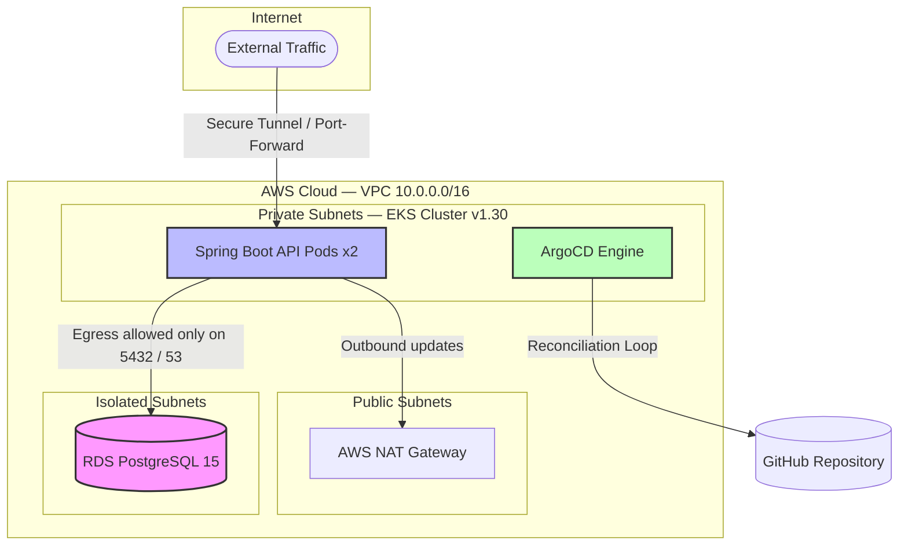
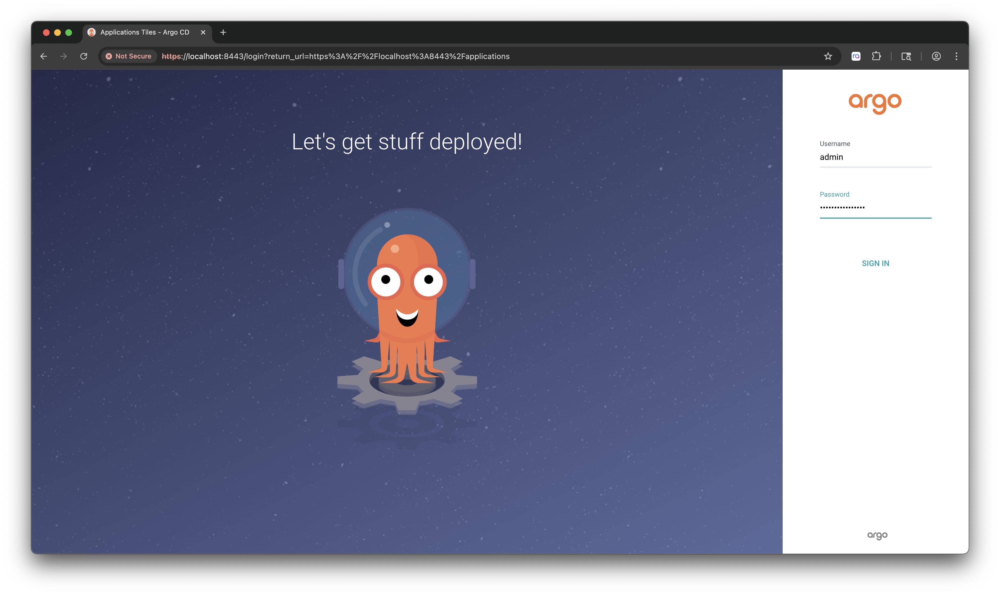
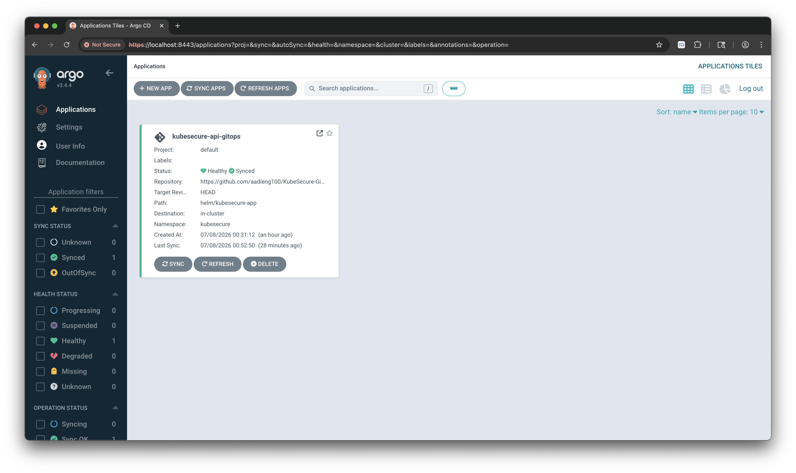

# 🛡️ KubeSecure-GitOps

> **Security-hardened Kubernetes GitOps platform** — from local Kind cluster to AWS EKS, with zero-trust networking, distroless containers, and infrastructure-as-code enforced at every layer.


> 📌 **Portfolio / demo project** — production-inspired architecture and security posture built to demonstrate real-world platform engineering competencies. Not a claim of live production usage.

---

## 🎯 Summary

KubeSecure-GitOps is a fully integrated DevSecOps platform that provisions hardened AWS infrastructure with Terraform, packages a Spring Boot REST API into a distroless container, and delivers it to AWS EKS through an ArgoCD GitOps pipeline. Every design decision — from subnet segmentation to Kubernetes NetworkPolicies — is driven by a least-privilege, defense-in-depth security model.

The workflow follows a **local-first** discipline: workloads are validated inside a Kind cluster before promotion to cloud infrastructure, reflecting how platform teams reduce blast radius during development.

---

## ✅ What This Project Demonstrates

| Area | Skills Evidenced |
|---|---|
| **GitOps** | ArgoCD Application CRs, reconciliation loop, sync strategies |
| **Infrastructure as Code** | Modular Terraform pattern library; environment composition roots |
| **AWS Networking** | VPC, 3-tier subnet segmentation (public / private / isolated), NAT Gateway |
| **Compute & Data** | Private EKS 1.30 managed node groups, RDS PostgreSQL 15 in an isolated subnet |
| **Container Security** | Multi-stage build, distroless base image, non-root UID, read-only root filesystem |
| **Kubernetes Security** | Default-deny NetworkPolicies, resource limits, least-privilege pod spec |
| **IAM & KMS** | Scoped EKS control-plane and worker-node roles, KMS-encrypted RDS storage |
| **Platform Workflow** | Kind → ECR → EKS promotion path with a single values-file flip |

---

## 🛠️ Tech Stack

| Layer | Technology |
|---|---|
| **Application** | Spring Boot (Java), REST API |
| **Container** | Docker multi-stage build, Google Distroless base |
| **Package Management** | Helm |
| **GitOps Engine** | ArgoCD |
| **Orchestration** | Kubernetes 1.30 (Kind locally, AWS EKS in cloud) |
| **Infrastructure** | Terraform (modular) |
| **Cloud** | AWS — EKS, RDS PostgreSQL, VPC, KMS, IAM, NAT Gateway, ECR |
| **Registry** | Amazon ECR (private) |

---

## 🏗️ Architecture at a Glance

Three isolated network tiers enforce strict workload separation:

```
┌─────────────────────────────────────────────────────────────┐
│  AWS VPC  (10.0.0.0/16)                                     │
│                                                             │
│  ┌──────────────┐   ┌──────────────────┐   ┌────────────┐  │
│  │ Public       │   │ Private          │   │ Isolated   │  │
│  │ Subnets      │   │ Subnets          │   │ Subnets    │  │
│  │              │   │                  │   │            │  │
│  │  NAT Gateway │   │  EKS Node Group  │   │  RDS PG 15 │  │
│  │  (egress)    │   │  ArgoCD          │   │  (no IGW,  │  │
│  │              │   │  Spring Boot API │   │   no NAT)  │  │
│  └──────────────┘   └──────────────────┘   └────────────┘  │
└─────────────────────────────────────────────────────────────┘
```

- EKS worker nodes communicate with the control plane over **private endpoints only**.
- RDS accepts connections **exclusively** from the EKS cluster security group on port `5432`.
- Application pod egress is restricted to DNS (`UDP 53`) and PostgreSQL (`TCP 5432`).

---

## 🔐 Security Hardening Highlights

**Container hardening:**
- Multi-stage Docker build — Maven toolchain never ships to the runtime image
- Distroless base image — no shell, no package manager, minimal attack surface
- Non-root runtime — unprivileged `appuser` (UID `10001`)
- Immutable root filesystem (`readOnlyRootFilesystem: true`); `/tmp` uses `emptyDir`

**Kubernetes hardening:**
- Default-deny NetworkPolicy — all traffic blocked unless explicitly permitted
- Egress allow-list: CoreDNS (`UDP 53`) and PostgreSQL (`TCP 5432`) only
- CPU and memory resource limits on every pod

**AWS / Terraform hardening:**
- EKS nodes provisioned with `ec2_ssh_key = null` — SSH surface eliminated
- RDS security group accepts inbound only from the EKS cluster SG (no public exposure)
- KMS encryption enabled on all RDS storage volumes
- Least-privilege IAM roles scoped separately for control-plane and worker nodes

---

## 💡 Why This Project Matters

Most GitOps tutorials stop at deploying an app. This project goes further:

1. **Security is structural, not bolted on.** Isolation, encryption, and least-privilege are baked into the Terraform modules, Helm chart, and Kubernetes manifests — not applied as afterthoughts.
2. **The Terraform pattern library is reusable.** Atomic, single-responsibility modules (`network`, `iam`, `compute`, `database`) are composed at the environment layer, enabling multi-environment rollout without module duplication.
3. **The local-first workflow mirrors real platform engineering.** Kind validation before cloud promotion reduces cloud spend and catch configuration errors before they become expensive incidents.
4. **The architectural retrospective is honest.** The Secret Management section documents the current demo trade-offs and the production-grade IRSA + External Secrets Operator path forward — showing engineering judgement, not just happy-path demos.

---

## 🗺️ System Architecture

### 1. Infrastructure Topology (AWS EKS & RDS)

The cloud infrastructure is provisioned with modular Terraform, enforcing strict micro-segmentation and defense-in-depth across three separate subnet tiers:

- **Public Tier** — Hosts only the AWS NAT Gateways. No application or compute workload runs here.
- **Private Tier** — Houses the private **AWS EKS 1.30** Managed Node Groups. Worker nodes reach the EKS control plane over private endpoints (`endpoint_private_access = true`).
- **Isolated Tier** — Hosts the encrypted **Amazon RDS PostgreSQL 15** instance. This tier has **zero routing** to the internet or the NAT Gateway — it is unreachable from the outside world by design.

### 2. Network & Application Flow



---

## 🔒 DevSecOps & Platform Engineering Hardening Checklist

### 💻 Container Level (Multi-Stage & Distroless)

- **Multi-Stage Build** — Compilation tools (Maven) are discarded in the builder stage. The final runtime image ships only the compiled `.jar`.
- **Distroless Base** — Runs on a minimal image with no shells (`sh`, `bash`), package managers (`apt`), or OS utilities, reducing the attack surface to near-zero.
- **Non-Root Enforcement** — The container process runs under an unprivileged user (`appuser`, UID `10001`).
- **Immutable Filesystem** — The root filesystem is mounted read-only (`readOnlyRootFilesystem: true`). Volatile operations write exclusively to an ephemeral scratch volume mounted at `/tmp` (`emptyDir: {}`).

### ⎈ Kubernetes Level (Helm & Network Policies)

- **Least-Privilege NetworkPolicies** — A default-deny posture is applied. Egress from the application pods is restricted to UDP port `53` (CoreDNS) and TCP port `5432` (PostgreSQL endpoint) only.
- **Resource Constraints** — Explicit CPU and memory requests and limits are configured via Helm values to protect nodes against malicious or accidental resource exhaustion (OOM-Killed protection).

### ☁️ Cloud & Terraform Level (Least Privilege & Crypto)

- **Infrastructure Pattern Library** — A decoupled architecture where atomic, single-responsibility modules (`network`, `iam`, `compute`, `database`) are entirely cloud-state agnostic. Multi-environment execution (dev, staging, prod) is driven purely by variable composition roots.
- **Security Group Micro-Filtering** — The RDS PostgreSQL instance accepts inbound connections (Ingress) exclusively from the EKS cluster's primary Security Group ID.
- **Data-at-Rest Encryption** — Storage-level encryption is enabled on the RDS volumes using AWS KMS keys.
- **No Backdoors** — EKS worker nodes are provisioned with `ec2_ssh_key = null`, closing the SSH surface entirely. Maintenance relies on audited session-management tooling instead.

---

## 📂 Repository Layout

```text
KubeSecure-GitOps/
├── app/                        # Spring Boot REST API application source
│   └── Dockerfile              # Secure multi-stage, non-root container build
├── helm/                       # Helm packaging
│   └── kubesecure-app/
│       ├── templates/          # Manifests (Deployment, Service, NetworkPolicy)
│       └── values.yaml         # Environment parameters
├── argocd/                     # GitOps manifests
│   └── application.yaml        # ArgoCD Application custom resource
└── terraform/                  # Infrastructure as Code (Pattern Library)
    ├── modules/                # Reusable building blocks
    │   ├── network/            # VPC · 3 subnet tiers · routing · NAT Gateway
    │   ├── iam/                # EKS control-plane & worker-node least-privilege roles
    │   ├── compute/            # Private EKS 1.30 cluster & managed node group
    │   └── database/           # Encrypted RDS PostgreSQL 15 & security groups
    └── environments/           # Composition roots (state allocation)
        └── aws-final/          # Orchestration root wiring the infrastructure modules
```

---

## 🚀 Deploy & Validate

### Phase 1 — Local-First Simulation (Kind)

Build the container image locally:

```bash
docker build -t kubesecure/gitops-api:1.0.0 ./app
```

Load the artifact directly into the Kind cluster node cache:

```bash
kind load docker-image kubesecure/gitops-api:1.0.0 --name kubesecure-cluster
```

Start GitOps syncing:

```bash
kubectl apply -f argocd/application.yaml
```

Access the ArgoCD Web UI (via port-forward or ingress) to monitor the synchronization state of the application:

##### 🔐 1. Authentication Portal
Log in using your administrator credentials:

<p align="center">
  
</p>

##### 🟢 2. Application Synchronization
Once authenticated, verify that the `kubesecure-api-gitops` application is successfully synchronized (`Healthy` and `Synced` status):

<p align="center">
  
</p>

### Phase 2 — Production Cloud Shift (AWS)

Initialize and provision the cloud infrastructure:

```bash
cd terraform/environments/aws-final/
terraform init
terraform apply -auto-approve
```

Point your local context at the remote cluster:

```bash
aws eks update-kubeconfig --region eu-west-3 --name kubesecure-final-demo-cluster
```

Push the image to your private ECR registry:

```bash
aws ecr get-login-password --region eu-west-3 \
  | docker login --username AWS --password-stdin <ACCOUNT_ID>.dkr.ecr.eu-west-3.amazonaws.com

docker tag kubesecure/gitops-api:1.0.0 \
  <ACCOUNT_ID>.dkr.ecr.eu-west-3.amazonaws.com/kubesecure/gitops-api:1.0.0

docker push \
  <ACCOUNT_ID>.dkr.ecr.eu-west-3.amazonaws.com/kubesecure/gitops-api:1.0.0
```

Trigger the GitOps reconciliation loop: set `environment: "aws"`, point `database.host` at the RDS endpoint in your `values.yaml`, push to Git, and watch ArgoCD sync the manifests onto EKS automatically.

---

## 🔍 Architectural Retrospective: Secret Management Strategy

> **Note on the current posture.** For the temporary validation phase of this demo, application secrets (database credentials) are managed with standard static Kubernetes Secrets injected into the namespace. This is acceptable for an ephemeral demo but is **not** a production-grade approach.

In a continuous, long-lived production pipeline, this posture should evolve toward a zero-trust model:

1. **Enable an OIDC provider identity** on the EKS cluster.
2. **Set up IRSA (IAM Roles for Service Accounts)** to establish a cryptographic trust link between an EKS pod and AWS IAM without hardcoded access tokens.
3. **Introduce the External Secrets Operator (ESO)** inside the cluster to consume that token, fetch credentials directly from AWS Secrets Manager, and rotate them automatically without manual intervention.

<!-- repository metadata updated -->
